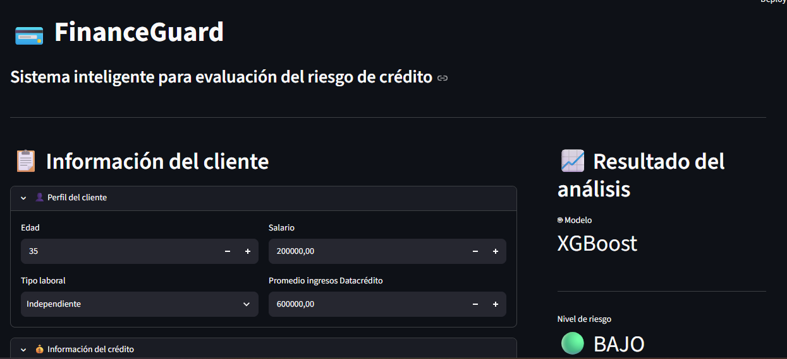
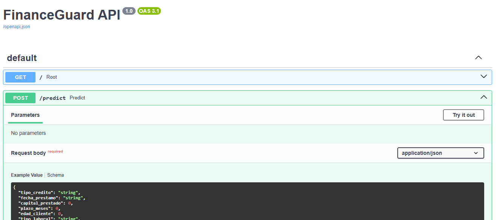

# 💳 FinanceGuard

## Sistema Inteligente para la Evaluación del Riesgo de Crédito

<p align="center">

</p>


# 💳 FinanceGuard
## Sistema Inteligente para la Evaluación del Riesgo de Crédito


---

# 📌 Descripción

FinanceGuard es una aplicación de Ciencia de Datos que implementa un modelo de Machine Learning para evaluar el riesgo de incumplimiento en solicitudes de crédito.

El proyecto integra un flujo completo de MLOps a pequeña escala, desde el procesamiento de datos hasta el despliegue del modelo mediante una API REST desarrollada con FastAPI y una interfaz interactiva construida con Streamlit.

El sistema permite que un analista financiero ingrese la información de un cliente y obtenga en tiempo real:

- Probabilidad de pago.
- Probabilidad de incumplimiento.
- Nivel de riesgo.
- Recomendación para la aprobación del crédito.

---

# 🎯 Objetivos

## Objetivo de negocio

Apoyar el proceso de evaluación crediticia mediante un modelo predictivo que permita reducir el riesgo de otorgar créditos a clientes con alta probabilidad de incumplimiento.

## Objetivos técnicos

- Construir un pipeline reproducible de Machine Learning.
- Implementar ingeniería de características.
- Comparar múltiples algoritmos de clasificación.
- Seleccionar automáticamente el mejor modelo.
- Desplegar el modelo mediante una API REST.
- Construir una interfaz gráfica para usuarios de negocio.
- Implementar un flujo de trabajo colaborativo utilizando GitFlow.

---

# 🛠 Tecnologías utilizadas

| Tecnología | Uso |
|------------|-----|
| Python 3.13 | Lenguaje principal |
| Pandas | Manipulación de datos |
| NumPy | Cálculo numérico |
| Scikit-Learn | Preprocesamiento y métricas |
| XGBoost | Modelo de clasificación |
| Joblib | Persistencia del modelo |
| FastAPI | API REST |
| Streamlit | Dashboard interactivo |
| Requests | Consumo de la API |
| Git | Control de versiones |
| GitHub | Repositorio |

---

# 📂 Estructura del proyecto

```text
PIM5_V1
│
├── api
│   ├── __init__.py
│   ├── model_deploy.py
│   └── schemas.py
│
├── data
│   └── raw
│
├── models
│   ├── modelo.pkl
│   ├── preprocessor.pkl
│   ├── Random Forest.pkl
│   └── XGBoost.pkl
│
├── reports
│
├── src
│   ├── __init__.py
│   ├── cargar_datos.py
│   ├── ft_engineering.py
│   ├── model_training_evaluation.py
│   ├── model_monitoring.py
│   ├── drift_metrics.py
│   └── visualizations.py
│
├── Dockerfile
├── Dockerfile.streamlit
├── docker-compose.yml
├── streamlit_app.py
├── requirements.txt
├── README.md
├── .dockerignore
├── .gitignore
└── LICENSE
```

# ⚙ Flujo del proyecto

```text
Carga de datos
        │
        ▼
Análisis Exploratorio
        │
        ▼
Feature Engineering
        │
        ▼
Preprocesamiento
        │
        ▼
Entrenamiento
        │
        ▼
Comparación de modelos
        │
        ▼
Selección del mejor modelo
        │
        ▼
Persistencia (Joblib)
        │
        ▼
FastAPI
        │
        ▼
Streamlit
        │
        ▼
Predicción en tiempo real
```

---

# 🤖 Modelos evaluados

Durante el entrenamiento se compararon varios algoritmos de clasificación:

- Logistic Regression
- Random Forest
- XGBoost

Las métricas evaluadas fueron:

- Accuracy
- Precision
- Recall
- F1 Score
- ROC AUC

El modelo seleccionado fue:

## 🏆 XGBoost

El modelo obtuvo el mejor desempeño sobre el conjunto de validación y fue serializado para su despliegue.

---

# 🚀 Arquitectura de despliegue

```text
               Usuario

                  │

                  ▼

      Dashboard Streamlit

                  │

                  ▼

      FastAPI (/predict)

                  │

                  ▼

       Preprocessor.pkl

                  │

                  ▼

          Modelo XGBoost

                  │

                  ▼

         Predicción JSON

                  │

                  ▼

 Dashboard de resultados
```

---

# 🌐 API REST

## Endpoint

```
POST /predict
```

### Ejemplo de solicitud

```json
{
  "tipo_credito":"1",
  "fecha_prestamo":"21/12/2024 11:31",
  "capital_prestado":3000000,
  "plazo_meses":12,
  "edad_cliente":35,
  "tipo_laboral":"Empleado",
  "salario_cliente":2500000,
  "total_otros_prestamos":2500000,
  "cuota_pactada":341296,
  "puntaje":88,
  "puntaje_datacredito":695,
  "cant_creditosvigentes":10,
  "huella_consulta":5,
  "saldo_mora":0,
  "saldo_total":51258,
  "saldo_principal":51258,
  "saldo_mora_codeudor":0,
  "creditos_sectorFinanciero":5,
  "creditos_sectorCooperativo":0,
  "creditos_sectorReal":0,
  "promedio_ingresos_datacredito":900000,
  "tendencia_ingresos":"Creciente"
}
```

### Respuesta

```json
{
    "prediccion":1,
    "probabilidad_pago":0.9704,
    "probabilidad_no_pago":0.0296
}
```

---

# 🖥 Dashboard Streamlit

La aplicación permite:

- Registro de la información del cliente.
- Consulta mediante FastAPI.
- Evaluación automática del crédito.
- Visualización del nivel de riesgo.
- Probabilidad de pago.
- Probabilidad de incumplimiento.
- Recomendación automática.

---

---

# 🐳 Despliegue con Docker

El proyecto se encuentra completamente contenerizado mediante Docker y Docker Compose.

Se crean dos servicios independientes:

- **FastAPI**, encargado de exponer el modelo mediante una API REST.
- **Streamlit**, encargado de proporcionar la interfaz gráfica para el usuario.

Arquitectura:

```text
                Docker Compose
                      │
      ┌───────────────┴───────────────┐
      │                               │
      ▼                               ▼
 FastAPI (Puerto 8000)        Streamlit (Puerto 8501)
      │                               │
      └───────────────┬───────────────┘
                      │
               Modelo XGBoost
```

Una vez iniciados los contenedores:

- API REST

```
http://localhost:8000/docs
```

- Dashboard

```
http://localhost:8501
```


# 🚀 Cómo ejecutar el proyecto

## 1. Clonar repositorio

```bash
git clone https://github.com/USUARIO/PIM5_V1.git
```

## 2. Crear entorno virtual

```bash
python -m venv venv
```

## 3. Activar entorno

Windows

```bash
venv\Scripts\activate
```

Linux

```bash
source venv/bin/activate
```

## 4. Instalar dependencias

```bash
pip install -r requirements.txt
```

---

## 5. Entrenar el modelo

```bash
python -m src.model_training_evaluation
```

Esto genera:

```
models/modelo.pkl

models/preprocessor.pkl
```

---

## 6. Ejecutar la API

```bash
uvicorn api.model_deploy:app --reload
```

Abrir:

```
http://127.0.0.1:8000/docs
```

---

## 7. Ejecutar Streamlit

```bash
streamlit run streamlit_app.py
```

---

# 🚀 Ejecución mediante Docker Compose

Una vez clonado el repositorio, ejecutar:

```bash
docker compose up --build
```

Docker realizará automáticamente:

- Construcción de la imagen de FastAPI.
- Construcción de la imagen de Streamlit.
- Creación de la red entre servicios.
- Inicio de ambos contenedores.

Una vez finalizado el proceso:

API REST

```
http://localhost:8000/docs
```

Dashboard Streamlit

```
http://localhost:8501
```

---

# 📈 Funcionalidades implementadas

- ✔ Limpieza y preparación de datos.
- ✔ Ingeniería de características.
- ✔ Pipeline de preprocesamiento.
- ✔ Comparación de múltiples modelos.
- ✔ Selección automática del mejor modelo.
- ✔ Persistencia del modelo con Joblib.
- ✔ API REST desarrollada con FastAPI.
- ✔ Dashboard interactivo desarrollado con Streamlit.
- ✔ Predicción en tiempo real.
- ✔ Arquitectura modular.
- ✔ Monitoreo básico del modelo.
- ✔ Contenerización mediante Docker.
- ✔ Orquestación con Docker Compose.
- ✔ Gestión del proyecto mediante GitFlow.

# 🔄 Flujo Git

```
feature
      │
      ▼
developer
      │
      ▼
certification
      │
      ▼
main
```

---

# 📸 Capturas del proyecto

## Dashboard Streamlit



## API REST - FastAPI (Swagger)



---

# 👨‍💻 Autor

**Daniel Ruiz**

Ingeniero Industrial • Especialista en Ingeniería de Operaciones

Especialista en Supply Chain, Gestión de Inventarios, Analítica de Datos y Ciencia de Datos aplicada a procesos logísticos y financieros.

### Tecnologías

- Python
- SQL
- PostgreSQL
- Scikit-Learn
- XGBoost
- FastAPI
- Streamlit
- Docker
- Power BI
- Git & GitHub

**LinkedIn**

https://www.linkedin.com/in/danielruiz-logistica


